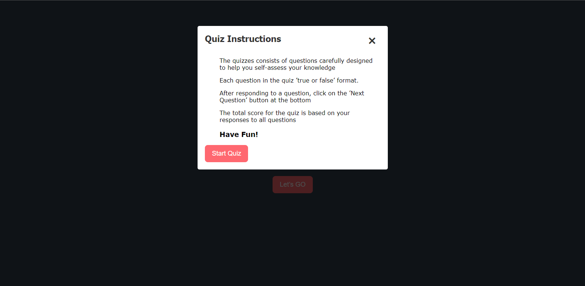
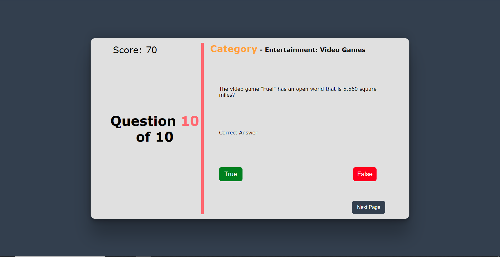

# Quiz App

This is a quiz app that uses the Open Trivia DB API to fetch questions. The app is built with React JS and is a small practice project.

[](https://github.com/Ekep-Obasi/React-Quiz-App)

[](https://github.com/Ekep-Obasi/React-Quiz-App)

[](https://github.com/Ekep-Obasi/React-Quiz-App)


## Features

* Fetches questions from the Open Trivia DB API
* Displays questions and answers in a user-friendly interface
* Allows users to answer questions and track their progress

## Getting Started

To get started with the quiz app, simply clone the repository and install the dependencies. Then, start the app by running the following command:

We will first start with setting up the Local Project Environment:

```sh
git clone https://github.com/Ekep-Obasi/React-Quiz-App.git
cd React-Quiz-App
npm run install
```

 - Create a .env file  according to .example.env given in both the folders.

Once you run the Commands and get environment variables and everything fine, we are all set to run the app ✔️

On the root level run the following command:

## Features

* Fetches questions from the Open Trivia DB API
* Displays questions and answers in a user-friendly interface
* Allows users to answer questions and track their progress

## Getting Started

To get started with the quiz app, simply clone the repository and install the dependencies. Then, start the app by running the following command:

We will first start with setting up the Local Project Environment:

```sh
git clone https://github.com/Ekep-Obasi/React-Quiz-App.git
cd React-Quiz-App
npm run install
```

 - Create a .env file  according to .example.env given in both the folders.

Once you run the Commands and get environment variables and everything fine, we are all set to run the app ✔️

On the root level run the following command:

```sh
npm run start
```